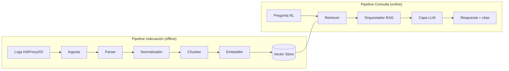

# 02 · Arquitectura

> Describe los **componentes** del MVP, sus **responsabilidades** y cómo se
> relacionan. La arquitectura se divide en dos tuberías (pipelines):
> **Indexación** (offline) y **Consulta** (online).

Diagrama fuente: [`diagrams/arquitectura_mvp.mmd`](diagrams/arquitectura_mvp.mmd)

---

## 1. Vista de alto nivel

El sistema tiene dos pipelines que comparten la **base vectorial**:

1. **Pipeline de Indexación (offline / batch):**
   `Logs → Ingesta → Parser → Normalizador → Chunker → Embedder → Vector store`
2. **Pipeline de Consulta (online / interactivo):**
   `Pregunta → Retriever → Orquestador RAG → LLM → Respuesta con citas`

> El diagrama Mermaid canónico y más detallado vive en el archivo `.mmd`. Este
> bloque embebido es un resumen para lectura rápida.

## 2. Principios de diseño

- **Separación de pipelines:** indexar es caro y se hace por lotes; consultar es
  ligero e interactivo. Desacoplarlos permite reindexar sin afectar la consulta.
- **Esquema normalizado común:** HAProxy e IIS se reducen a un mismo modelo de
  evento → el resto del sistema no distingue la fuente.
- **Parámetros externalizados:** ningún valor mágico en el código; todo en
  configuración documentada ([`04_parametros_configuracion.md`](04_parametros_configuracion.md)).
- **Solo lectura:** el sistema nunca escribe ni actúa sobre infraestructura.
- **Citabilidad:** cada chunk conserva metadatos (archivo, línea, timestamp)
  para que la respuesta sea auditable.

## 3. Componentes

Cada componente se documenta con la ficha estándar del proyecto: **qué hace,
cuándo se invoca, entradas, salidas, fallos posibles y efecto de parámetros.**

### 3.1 Ingesta
- **Qué hace:** localiza y lee los archivos de log de ejemplo.
- **Cuándo se invoca:** al inicio del pipeline de indexación.
- **Entradas:** ruta(s) a archivos/carpeta de logs.
- **Salidas:** flujo de líneas crudas + metadatos (archivo de origen, nº de línea).
- **Puede fallar si:** ruta inexistente, archivo ilegible, codificación inválida.
- **Efecto de parámetros:** patrón de archivos y codificación cambian qué se lee.

### 3.2 Parser (HAProxy / IIS)
- **Qué hace:** interpreta cada línea según el formato de su fuente.
- **Cuándo se invoca:** tras la ingesta, por cada línea cruda.
- **Entradas:** línea cruda + tipo de fuente.
- **Salidas:** registro estructurado (campos extraídos) o marca de "no parseable".
- **Puede fallar si:** formato de log distinto al esperado, líneas corruptas.
- **Efecto de parámetros:** el formato/patrón configurado determina qué campos
  se extraen y qué líneas se descartan.

### 3.3 Normalizador
- **Qué hace:** mapea los registros de cada fuente al **esquema común** de evento
  normalizado de 13 campos (ver §3.3.1 y ADR-010).
- **Cuándo se invoca:** tras el parser, antes del chunking.
- **Quién lo invoca:** el orquestador del parser (`src/parse_logs.py`) a través
  de cada parser de fuente (R2).
- **Entradas:** registro estructurado específico de fuente.
- **Salidas:** evento normalizado (dict con las 13 claves canónicas).
- **Puede fallar si:** timestamp no convertible (→ `timestamp=null`); falta un
  campo núcleo (no debería ocurrir: los provee la ingesta).
- **Efecto de parámetros:** `timezone` desplaza los timestamps; el mapeo de
  campos por fuente determina qué se rellena y qué queda en `null`.

#### 3.3.1 Esquema del evento normalizado (contrato canónico — ADR-010)

> Todas las claves están **siempre presentes** (esquema fijo); la ausencia de
> dato se representa con `null`. Implementado en `src/schema.py` (`EVENT_FIELDS`).

| Campo | Tipo | Obligatoriedad | Notas |
|-------|------|----------------|-------|
| `source` | str enum | **Núcleo (no nulo)** | `haproxy`\|`iis` (extensible). |
| `severity` | str enum | **Núcleo (no nulo)** | Derivada del status: 5xx=error, 4xx=warning, resto=info. |
| `source_file` | str | **Núcleo (no nulo)** | Citabilidad. |
| `line_number` | int | **Núcleo (no nulo)** | Citabilidad. |
| `raw` | str | **Núcleo (no nulo)** | Línea original íntegra (evidencia). |
| `timestamp` | str ISO-8601 \| null | Presente; nulo si no parseable | Normalizado a `timezone`. |
| `client_ip` | str \| null | Opcional | — |
| `method` | str \| null | Opcional | HTTP. |
| `path` | str \| null | Opcional | Stem + query si aplica. |
| `status_code` | int \| null | Opcional | HTTP. |
| `bytes` | int \| null | Opcional | Bytes de respuesta. |
| `duration_ms` | int \| null | Opcional | Latencia (ms). |
| `backend` | str \| null | Opcional | Solo HAProxy. |

**Mapeo por fuente (resumen; detalle en `03_flujos.md` §2.1):**

| Campo | HAProxy (HTTP log) | IIS (W3C) |
|-------|--------------------|-----------|
| `timestamp` | accept-date `[dd/Mon/AAAA:HH:MM:SS]` | `date` + `time` |
| `client_ip` | IP del cliente | `c-ip` |
| `method`/`path` | de `"GET /ruta HTTP/1.1"` | `cs-method` / `cs-uri-stem`(+`cs-uri-query`) |
| `status_code` | campo status | `sc-status` |
| `bytes` | bytes leídos | `sc-bytes` (ausente por defecto → `null`) |
| `duration_ms` | `Tt` (nulo si `<0`) | `time-taken` (ms) |
| `backend` | `backend/server` | `null` (IIS no expone backend) |

**Eventos futuros:** una fuente nueva añade un valor al enum `source`, deja en
`null` los campos HTTP que no apliquen y conserva `source_file`/`line_number`/`raw`.
Para datos estructurados propios se añadirá un campo opcional `attributes` vía un
ADR futuro (no se crea aún — YAGNI). Ver ADR-010.

### 3.4 Chunker (implementado en Fase 2B — ADR-011)
- **Qué hace:** agrupa eventos normalizados en **ventanas de N eventos con
  solape** (estrategia `by_events`) y produce chunks con texto + metadatos.
- **Cuándo se invoca:** tras el parser, sobre los `*.events.jsonl`.
- **Quién lo invoca:** el orquestador `src/chunk_logs.py` (`python -m src.chunk_logs`).
- **Entradas:** eventos normalizados (de `data/processed/*.events.jsonl`).
- **Salidas:** chunks (`data/processed/*.chunks.jsonl`) con `text` + metadatos de
  rango (`source_file`, `line_start/end`, `ts_start/end`, `severities`,
  `event_lines`). Esquema completo en `03_flujos.md` §2.2.
- **Puede fallar si:** `chunk_overlap >= chunk_size` (config inválida); no hay
  archivos `*.events.jsonl`; línea JSONL corrupta.
- **Efecto de parámetros:** `chunk_size`/`chunk_overlap` afectan recall, precisión
  y coste; cambiarlos obliga a re-chunkear. Implementado con **stdlib pura** (sin IA).

### 3.5 Embedder (implementado en Fase 2C — ADR-012)
- **Qué hace:** convierte el `text` de cada chunk en un vector (embedding) con un
  modelo **local** (`all-MiniLM-L6-v2`, 384-d), arrastrando los metadatos.
- **Cuándo se invoca:** tras el chunking, sobre los `*.chunks.jsonl`.
- **Quién lo invoca:** el orquestador `src/embed_chunks.py` (`python -m src.embed_chunks`).
- **Entradas:** chunks (de `data/processed/*.chunks.jsonl`).
- **Salidas:** registros `embedding` + metadatos (`data/processed/*.embeddings.jsonl`).
  Esquema completo en `03_flujos.md` §2.3.
- **Puede fallar si:** el modelo no está disponible (no instalado / sin red la 1ª
  vez); `processed_path` sin chunks.
- **Efecto de parámetros:** `embedding_model` define dimensión/semántica (cambiarlo
  **obliga a reindexar**); `embedding_batch_size` solo afecta velocidad/memoria.
  Embeddings **locales** por privacidad (los logs no salen del equipo). **Aún NO
  indexa en Chroma** (Fase 2D).

### 3.6 Vector store (implementado en Fase 2D — ADR-013: Chroma)
- **Qué hace:** almacena embeddings + metadatos en una colección **Chroma** local
  y persistente, y permitirá búsqueda por similitud (la lectura llega en Fase 3).
- **Cuándo se invoca:** **escritura** en indexación (Fase 2D, implementado);
  lectura en consulta (Fase 3, aún no).
- **Quién lo invoca:** el orquestador `src/index_embeddings.py`
  (`python -m src.index_embeddings`).
- **Entradas:** registros de `data/processed/*.embeddings.jsonl`.
- **Salidas:** colección Chroma persistida en `data/index/` (ids=`chunk_id`,
  vector, metadatos aplanados de citabilidad/filtrado). Detalle en `03_flujos.md` §2.4.
- **Puede fallar si:** `chromadb` no instalado; sin `*.embeddings.jsonl`;
  dimensión incompatible con la colección.
- **Efecto de parámetros:** `similarity_metric` define la métrica de la colección;
  `index_path`/`collection_name` dónde y en qué colección se persiste; cambiar el
  modelo de embeddings (dimensión) **obliga a reconstruir**. **Aún NO se consulta**
  (sin NL, sin RAG, sin LLM).

### 3.7 Retriever
- **Qué hace:** dada una pregunta, la embebe y consulta el vector store.
- **Cuándo se invoca:** al inicio del pipeline de consulta.
- **Entradas:** pregunta en lenguaje natural.
- **Salidas:** lista de chunks relevantes (con metadatos para citar).
- **Puede fallar si:** vector store vacío; embedder no disponible.
- **Efecto de parámetros:** `top_k` y umbral de similitud afectan cobertura/ruido.

### 3.8 Orquestador RAG
- **Qué hace:** ensambla el contexto recuperado y construye el prompt para el LLM.
- **Cuándo se invoca:** tras el retriever.
- **Entradas:** pregunta + chunks recuperados.
- **Salidas:** prompt final (instrucciones + contexto + pregunta).
- **Puede fallar si:** el contexto excede la ventana del modelo.
- **Efecto de parámetros:** plantilla de prompt y presupuesto de tokens cambian
  la calidad y el coste de la respuesta.

### 3.9 Capa LLM
- **Qué hace:** genera la respuesta a partir del prompt, citando los logs.
- **Cuándo se invoca:** tras el orquestador.
- **Entradas:** prompt ensamblado.
- **Salidas:** respuesta en lenguaje natural con citas a líneas de log.
- **Puede fallar si:** el proveedor del modelo no responde; límite de tokens.
- **Efecto de parámetros:** modelo, temperatura y máx. tokens afectan
  determinismo, longitud y coste.

### 3.10 Interfaz de consulta
- **Qué hace:** recibe la pregunta del usuario y muestra la respuesta.
- **Cuándo se invoca:** punto de entrada del usuario (CLI o web mínima).
- **Entradas:** texto del usuario.
- **Salidas:** respuesta formateada con sus citas.
- **Puede fallar si:** entrada vacía; backend de consulta no disponible.
- **Efecto de parámetros:** modo de salida (texto/JSON) y verbosidad.

## 4. Tabla resumen de componentes

| Componente | Pipeline | Entrada principal | Salida principal |
|---|---|---|---|
| Ingesta | Indexación | Rutas de logs | Líneas crudas + metadatos |
| Parser | Indexación | Línea cruda | Registro estructurado |
| Normalizador | Indexación | Registro estructurado | Evento normalizado |
| Chunker | Indexación | Eventos normalizados | Chunks + metadatos |
| Embedder | Indexación | Texto de chunk | Vector |
| Vector store | Ambos | Vectores / consulta | Top-k chunks |
| Retriever | Consulta | Pregunta NL | Chunks relevantes |
| Orquestador RAG | Consulta | Pregunta + chunks | Prompt |
| Capa LLM | Consulta | Prompt | Respuesta + citas |
| Interfaz | Consulta | Texto usuario | Respuesta formateada |

## 5. Vista tecnológica

> Las decisiones de Fase 2 ya están **tomadas a nivel de diseño** (Fase 2A) y
> justificadas en [`05_bitacora_decisiones.md`](05_bitacora_decisiones.md);
> **aún no implementadas**. La arquitectura sigue siendo agnóstica: cambiar una
> elección solo afecta a su componente.

| Capa | Decisión | Estado | ADR |
|---|---|---|---|
| Lenguaje | Python | Implementado | — |
| Chunking | Ventana de N eventos con solape (`by_events`) | Diseño | ADR-011 |
| Embeddings | Local `all-MiniLM-L6-v2` (384-d) | Diseño | ADR-012 |
| Vector store | Chroma (local, persistente) | Diseño | ADR-013 |
| Recuperación | top-k denso (coseno) + filtros de metadatos | Diseño | ADR-014 |
| LLM | Por decidir (Fase 4) | Pendiente | — |
| Interfaz | CLI primero; web mínima opcional | Diseño | ADR-006 |

## 6. Atributos de calidad y cómo se atienden

| Atributo | Cómo lo aborda la arquitectura |
|---|---|
| Trazabilidad | Metadatos por chunk + matriz de trazabilidad + ADR |
| Mantenibilidad | Componentes desacoplados; parámetros externalizados |
| Seguridad | Solo lectura; sin acciones sobre infraestructura |
| Confiabilidad | Respuestas ancladas en evidencia (RAG + citas) |
| Demostrabilidad | Pipelines simples y observables paso a paso |

---

> Ver flujos detallados en [`03_flujos.md`](03_flujos.md).
