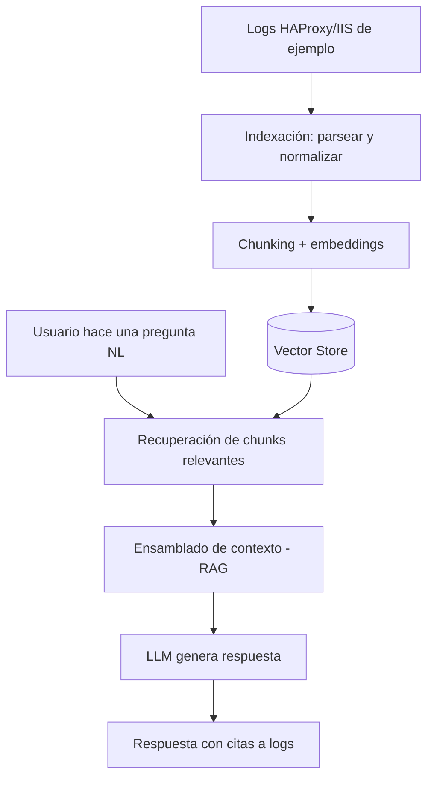
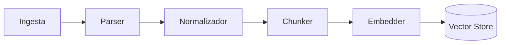
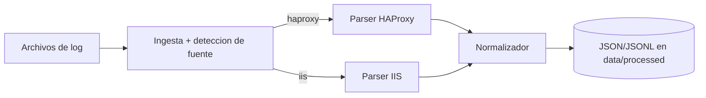
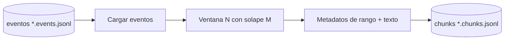
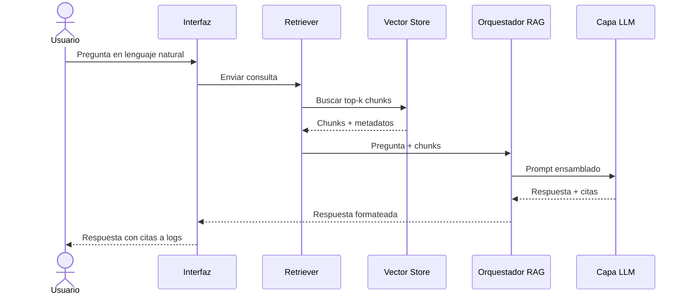

# 03 · Flujos

> Describe paso a paso los **flujos importantes** del MVP. Por regla del
> proyecto, ningún flujo se implementa sin estar documentado y diagramado aquí.

Diagramas fuente:
- [`diagrams/flujo_general.mmd`](diagrams/flujo_general.mmd) — flujo end-to-end.
- [`diagrams/secuencia_consulta.mmd`](diagrams/secuencia_consulta.mmd) — secuencia de consulta.

---

## 1. Flujo general (end-to-end)

Visión completa: desde tener archivos de log hasta obtener una respuesta.

### Fases del flujo general
1. **Preparación (manual):** se colocan logs de ejemplo en la carpeta de datos.
2. **Indexación (offline):** se ejecuta el pipeline de indexación una vez.
3. **Consulta (online):** el usuario pregunta cuantas veces quiera contra el índice.

---

## 2. Flujo de Indexación (offline)

**Cuándo se ejecuta:** una vez por conjunto de logs, o al reindexar tras un cambio
de parámetros (p. ej. tamaño de chunk o modelo de embeddings).

| Paso | Acción | Componente | Entrada | Salida |
|------|--------|-----------|---------|--------|
| 1 | Localizar y leer archivos | Ingesta | Rutas/patrón | Líneas crudas + metadatos |
| 2 | Detectar formato y parsear | Parser | Línea cruda | Registro estructurado |
| 3 | Mapear a esquema común | Normalizador | Registro | Evento normalizado |
| 4 | Agrupar en fragmentos | Chunker | Eventos | Chunks + metadatos |
| 5 | Vectorizar | Embedder | Texto de chunk | Vector |
| 6 | Persistir índice | Vector store | Vectores + metadatos | Índice consultable |

**Qué puede fallar:**
- Archivos ausentes o ilegibles → la ingesta aborta con error claro.
- Líneas no parseables → se descartan y se contabilizan (no detienen el flujo).
- Modelo de embeddings no disponible → falla la vectorización.

**Efecto de cambiar parámetros (ejemplos):**
- ↑ tamaño de chunk → menos chunks, más contexto por chunk, posible pérdida de
  precisión en la recuperación.
- Cambiar modelo de embeddings → **obliga a reindexar** (dimensiones distintas).

---

## 2.1 Subflujo de Parsing (Fase 1 — implementado)

> Detalle de los pasos 1–3 del pipeline de indexación (Ingesta → Parser →
> Normalizador). Es la **única parte implementada en código** (Fase 1). No incluye
> chunking, embeddings ni vector store (fases posteriores).

**Cuándo se ejecuta:** al invocar el parser sobre la carpeta de logs de ejemplo
(`python -m src.parse_logs`). Es un proceso batch, offline y de **solo lectura**.

### Pasos detallados

| Paso | Acción | Componente | Entrada | Salida |
|------|--------|-----------|---------|--------|
| 1 | Listar archivos según `file_pattern` | Ingesta | `logs_path` | Lista de archivos |
| 2 | Leer línea a línea con `encoding` | Ingesta | Archivo | Líneas crudas + nº de línea |
| 3 | Detectar fuente (`source_type`) | Ingesta | Nombre/contenido | `haproxy` \| `iis` |
| 4 | Parsear según formato | Parser HAProxy/IIS | Línea cruda | Campos extraídos |
| 5 | Aplicar política ante error | Parser | Línea no parseable | Descartar/incluir/abortar |
| 6 | Mapear a esquema común | Normalizador | Campos extraídos | Evento normalizado |
| 7 | Derivar `severity` del `status_code` | Normalizador | status_code | info/warning/error |
| 8 | Serializar a JSON/JSONL | Salida | Eventos | Archivo en `data/processed/` |

### Esquema normalizado (evento común)

Ambas fuentes se reducen a este modelo. La existencia de un esquema común la
decidió **ADR-003**; sus **campos concretos y su obligatoriedad** los fija
**ADR-010**. El contrato está implementado en `src/schema.py` (`EVENT_FIELDS`).

> **Esquema fijo, valores nullable:** las 13 claves están **siempre presentes**;
> la ausencia de dato se expresa con `null` (nunca se omite la clave).

| Campo | Tipo | Obligatoriedad | Origen / significado |
|-------|------|----------------|----------------------|
| `source` | string enum | **Núcleo (no nulo)** | `haproxy` \| `iis` (extensible) |
| `severity` | string enum | **Núcleo (no nulo)** | Derivada: `error` (5xx), `warning` (4xx), `info` (resto) |
| `source_file` | string | **Núcleo (no nulo)** | Archivo de origen (para citar) |
| `line_number` | int | **Núcleo (no nulo)** | Nº de línea de origen (para citar) |
| `raw` | string | **Núcleo (no nulo)** | Línea original íntegra (evidencia/cita) |
| `timestamp` | string ISO-8601 \| null | Presente; **nulo si no parseable** | Fecha/hora normalizada a `timezone` |
| `client_ip` | string \| null | Opcional | IP del cliente (anonimizada en ejemplos) |
| `method` | string \| null | Opcional | Método HTTP (GET, POST…) |
| `path` | string \| null | Opcional | Ruta solicitada (con query si aplica) |
| `status_code` | int \| null | Opcional | Código de estado HTTP |
| `bytes` | int \| null | Opcional | Bytes de respuesta |
| `duration_ms` | int \| null | Opcional | Latencia/tiempo de servicio en ms |
| `backend` | string \| null | Opcional (solo HAProxy) | Backend/servidor |

> Los **5 campos núcleo** (`source`, `severity`, `source_file`, `line_number`,
> `raw`) están garantizados no nulos: aseguran identidad, clasificación y
> **citabilidad** (clave para que el RAG futuro apunte a la evidencia exacta).

#### Mapeo por fuente

| Campo | HAProxy (HTTP log) | IIS (W3C Extended) |
|-------|--------------------|--------------------|
| `timestamp` | accept-date `[dd/Mon/AAAA:HH:MM:SS.mmm]` | `date` + `time` |
| `client_ip` | IP del cliente (antes de `:puerto`) | `c-ip` |
| `method` / `path` | de la petición `"GET /ruta HTTP/1.1"` | `cs-method` / `cs-uri-stem` (+`cs-uri-query`) |
| `status_code` | campo de estado | `sc-status` |
| `bytes` | bytes leídos | `sc-bytes` (ausente por defecto → `null`) |
| `duration_ms` | `Tt` (tiempo total; `null` si `< 0`) | `time-taken` (ya en ms) |
| `backend` | `backend/server` (p. ej. `be_api/<NOSRV>`) | `null` |

#### Eventos futuros (extensibilidad — ADR-010)

Para incorporar una fuente nueva (p. ej. `syslog`, `app`, `healthcheck`):
1. Se añade su valor al **enum `source`** y se escribe un parser que cumpla el
   mismo contrato `parse_line() -> (status, event)`.
2. Los campos HTTP que no apliquen (`method`, `path`, `status_code`, `backend`)
   se dejan en `null`; el evento se apoya en `severity` + `raw`.
3. Se conservan **siempre** `source_file`/`line_number`/`raw` (citabilidad).
4. Para datos estructurados propios de esa fuente se añadirá un campo opcional
   `attributes` (objeto) mediante un **ADR futuro** (no existe aún — YAGNI/R10).

### Qué puede fallar

- `logs_path` inexistente o sin archivos que casen `file_pattern` → error claro y aborta.
- Codificación incorrecta (`encoding`) → líneas ilegibles; se reporta.
- Línea no conforme al formato → según `on_parse_error`: `skip` (descartar y
  contar), `keep` (incluir con campos nulos + `raw`) o `fail` (abortar).
- IIS sin cabecera `#Fields:` → no se pueden mapear columnas; se reporta.
- Timestamp no convertible → el evento se marca con `timestamp` nulo (modo `keep`)
  o se descarta (modo `skip`).

### Efecto de cambiar parámetros

- `source_type=auto` vs forzado → cambia cómo se elige el parser por archivo.
- `on_parse_error` → controla si las líneas problemáticas se pierden, se conservan
  o detienen todo el proceso (clave para depurar formatos nuevos).
- `timezone` → desplaza todos los `timestamp` normalizados.
- `output_format` (`json` vs `jsonl`) → un único array vs un objeto por línea
  (JSONL es más amigable para el chunking incremental de la Fase 2).

---

## 2.2 Subflujo de Chunking (Fase 2B — implementado)

> Detalle del paso 4 del pipeline de indexación (Chunker). Convierte los eventos
> normalizados en **chunks** (unidades indexables) según **ADR-011**. Es código
> **stdlib puro**: NO usa embeddings, vector store ni librerías de IA.

**Cuándo se ejecuta:** tras el parser, sobre los archivos `*.events.jsonl` de
`data/processed/`. Proceso batch, offline, **solo lectura** de los eventos.

**Quién lo invoca:** el orquestador `python -m src.chunk_logs` (o la Fase 2
completa en el futuro).

**Entrada → Salida:** `data/processed/<stem>.events.jsonl` → `data/processed/<stem>.chunks.jsonl`.

### Pasos detallados

| Paso | Acción | Entrada | Salida |
|------|--------|---------|--------|
| 1 | Listar archivos `*.events.jsonl` | `processed_path` | Lista de archivos de eventos |
| 2 | Cargar eventos (un objeto por línea) | Archivo JSONL | Lista de eventos normalizados |
| 3 | Agrupar en ventanas de `chunk_size` con `chunk_overlap` | Eventos en orden | Ventanas de eventos |
| 4 | Construir metadatos de rango y texto del chunk | Ventana | Chunk |
| 5 | Serializar a JSONL | Chunks | `<stem>.chunks.jsonl` |

### Esquema del chunk (contrato Fase 2B)

| Campo | Tipo | Significado |
|-------|------|-------------|
| `chunk_id` | string | Id estable: `<stem>-<índice>` (p. ej. `haproxy_sample-0`) |
| `source_file` | string | Archivo(s) de log de origen de los eventos |
| `sources` | list[str] | Fuentes distintas presentes (`haproxy`/`iis`) |
| `line_start` | int | `line_number` del primer evento del chunk |
| `line_end` | int | `line_number` del último evento del chunk |
| `ts_start` | string ISO \| null | Timestamp mínimo (no nulo) del chunk |
| `ts_end` | string ISO \| null | Timestamp máximo del chunk |
| `n_events` | int | Nº de eventos en el chunk |
| `severities` | dict | Conteo por severidad (`info`/`warning`/`error`) |
| `event_lines` | list[int] | `line_number` de cada evento (citabilidad fina) |
| `text` | string | Render textual compacto de los eventos (se embeberá en Fase 2C) |

> `source_file`, `line_start`/`line_end` y `event_lines` garantizan la
> **citabilidad** del chunk (RNF-05): se sabe exactamente qué evidencia contiene.

### Qué puede fallar

- `processed_path` sin archivos `*.events.jsonl` → error claro y aborta.
- `chunk_overlap >= chunk_size` → configuración inválida; el chunker aborta.
- Línea JSONL corrupta en un `.events.jsonl` → se reporta el archivo/línea.
- Archivo de eventos vacío → produce 0 chunks (no es error).

### Efecto de cambiar parámetros

- ↑`chunk_size` → menos chunks, más contexto por chunk, menor precisión de
  recuperación y mayor coste por chunk (en fases siguientes).
- ↑`chunk_overlap` → más redundancia entre chunks y más chunks totales.
- Cambiar cualquiera de los dos **obliga a re-chunkear** (y reindexar en Fase 2C).

---

## 3. Flujo de Consulta (online)

**Cuándo se ejecuta:** cada vez que el usuario formula una pregunta.

| Paso | Acción | Componente | Entrada | Salida |
|------|--------|-----------|---------|--------|
| 1 | Recibir pregunta | Interfaz | Texto del usuario | Pregunta NL |
| 2 | Embeber la pregunta | Retriever/Embedder | Pregunta NL | Vector de consulta |
| 3 | Buscar top-k similares | Vector store | Vector + k | Chunks relevantes |
| 4 | Ensamblar contexto + prompt | Orquestador RAG | Pregunta + chunks | Prompt |
| 5 | Generar respuesta | Capa LLM | Prompt | Texto + citas |
| 6 | Formatear y mostrar | Interfaz | Respuesta | Salida al usuario |

**Qué puede fallar:**
- Índice vacío (no se indexó) → respuesta de "sin datos".
- Pregunta vaga → recuperación ruidosa; el prompt debe pedir al LLM no inventar.
- Contexto demasiado largo → se recorta según presupuesto de tokens.
- Proveedor LLM caído → error controlado, se informa al usuario.

**Efecto de cambiar parámetros (ejemplos):**
- ↑ `top_k` → más contexto recuperado (más recall, más ruido y coste).
- ↑ temperatura del LLM → respuestas más creativas pero menos deterministas.
- Cambiar plantilla de prompt → cambia el estilo y la fidelidad de las citas.

### Diagrama de secuencia (resumen)

---

## 4. Flujo de reindexación (mantenimiento)

**Cuándo:** al cambiar parámetros que afectan el índice (modelo de embeddings,
chunking) o al añadir nuevos logs.

1. Invalidar/limpiar el índice anterior (o versionarlo).
2. Re-ejecutar el pipeline de indexación completo.
3. Verificar que la consulta sigue devolviendo resultados coherentes.

> **Nota:** cambiar el **modelo de embeddings** es incompatible con un índice
> previo (distinta dimensión) → siempre requiere reindexación total.

---

## 5. Manejo de errores (transversal)

| Situación | Estrategia |
|---|---|
| Línea de log no parseable | Descartar + contabilizar; continuar |
| Archivo ilegible | Abortar ingesta con mensaje claro |
| Índice inexistente en consulta | Responder "sin datos indexados" |
| LLM/Embedder no disponible | Error controlado, sin acción sobre infra |
| Contexto excede ventana | Truncar según presupuesto de tokens |

---

> Los valores concretos (k, tamaño de chunk, modelo, etc.) están en
> [`04_parametros_configuracion.md`](04_parametros_configuracion.md).
