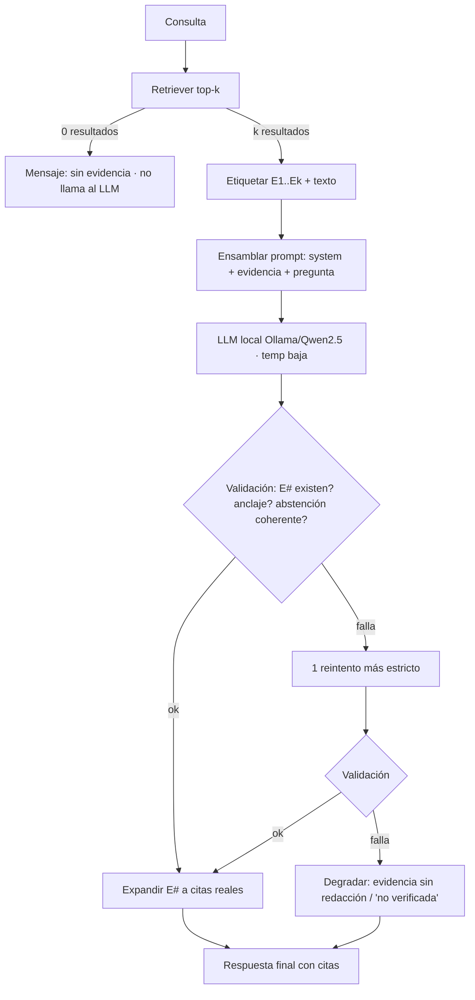

# 92 · Diseño de la Capa LLM (Fase 4B) — prompt, anti-alucinación, citas y validación

> Diseño **previo a la implementación** (doc-driven, ADR-004) de la generación de
> respuestas del MVP. Decisiones vinculantes en **ADR-016** (modelo: Ollama +
> Qwen2.5 7B) y **ADR-017** (este diseño). Pregunta de defensa: **P-30**.
> **Estado: ACEPTADA (diseño) — sin código** (aprobada el 2026-06-02; la
> implementación es Fase 4B, aún no iniciada). Cubre RF-09 (ensamblar
> contexto/prompt), RF-10 (generar con LLM) y RF-11 (citar líneas), con RNF-05
> (citas verificables sin alucinación) como criterio rector.

---

## 1. Principio rector

> **La integridad de la cita NO depende del LLM.** El modelo redacta y referencia
> evidencia con tokens `[E#]`; **el sistema** —no el modelo— traduce cada `[E#]` a
> una cita real usando metadatos de confianza del retriever. Así, **una cita
> fabricada es imposible por construcción**: el LLM nunca escribe archivos ni
> números de línea.

Esto convierte RNF-05 ("citas verificables, sin alucinación") en un **control
ejecutable** (validación programática), no en una súplica dentro del prompt.

## 2. Arquitectura de prompt

Tres bloques ensamblados por el orquestador (RF-09):

### 2.1 System prompt (reglas, fijo)

```text
Eres un asistente de diagnóstico de incidentes de operaciones. Respondes
EXCLUSIVAMENTE a partir de los fragmentos de log etiquetados como EVIDENCIA.

Reglas (estrictas):
1. Usa SOLO la EVIDENCIA. No uses conocimiento externo ni inventes datos.
2. Toda afirmación factual debe llevar al menos una cita [E#] de la EVIDENCIA.
3. Cita ÚNICAMENTE con los identificadores [E1], [E2], ... que aparecen en la
   EVIDENCIA. NUNCA escribas nombres de archivo ni números de línea por tu cuenta.
4. Si la EVIDENCIA no permite responder, responde EXACTAMENTE:
   "No hay evidencia suficiente en los logs para responder esa pregunta."
5. Responde en español, conciso y técnico.
6. No propongas acciones sobre infraestructura (el sistema es de solo lectura).

Formato de salida EXACTO:
Respuesta: <respuesta con marcadores [E#]>
Evidencia: <cada [E#] citado, uno por línea>
```

### 2.2 Bloque de EVIDENCIA (construido por el sistema)

Cada resultado del retriever (ADR-014) se etiqueta `[E1..Ek]` con una cabecera de
metadatos **de confianza** + el **texto** del chunk (ver §8 sobre el origen del
texto):

```text
EVIDENCIA:
[E1] (score 0.83) origen=api-account-devl...log líneas=1-11
     ts=2026-05-18T04:47:44..04:47:45 severidades=error:4,warning:1
<texto del chunk: líneas de evento renderizadas>
---
[E2] (score 0.71) origen=api-account-devl...log líneas=9-28 ...
<texto del chunk>
```

### 2.3 Bloque de PREGUNTA

```text
PREGUNTA: <consulta del usuario, tal cual>
```

### 2.4 Contrato de salida

El modelo devuelve dos secciones: `Respuesta:` (prosa con `[E#]`) y `Evidencia:`
(los `[E#]` usados). El parser extrae ambas; los `[E#]` se **expanden** a citas
reales (§4) y se **validan** (§5).

## 3. Estrategia anti-alucinación (defensa en capas)

| # | Capa | Qué evita | Cómo |
|---|------|-----------|------|
| 1 | **Grounding por construcción (RAG)** | Inventar hechos | Solo la evidencia recuperada entra al contexto; el system prompt prohíbe lo externo |
| 2 | **Citas `[E#]` deterministas** | **Citas/línea fabricadas** | El modelo solo emite `[E#]`; el sistema expande desde metadatos de confianza |
| 3 | **Anclaje obligatorio** | Afirmaciones sin respaldo | Toda frase factual exige ≥1 `[E#]`; la validación lo comprueba |
| 4 | **Abstención controlada** | Adivinar sin datos | Texto fijo de "evidencia insuficiente" cuando no se puede responder |
| 5 | **Validación post-generación** | Que pase una respuesta mal citada | Verificación programática + 1 reintento estricto + degradación elegante |
| 6 | **Temperatura baja (0.0–0.2)** | Variabilidad/creatividad | Determinismo reproducible |
| 7 | **Solo-lectura (ADR-005)** | Sugerir acciones peligrosas | Regla 6 del system prompt |

## 4. Formato exacto de las citas

- **Marcador en el texto:** `[E1]`, `[E2]`, … (índice de evidencia **dentro de esta
  respuesta**). El modelo escribe estos y nada más.
- **Cita expandida** (la genera el sistema desde metadatos del retriever):

  ```text
  [E1] api-account-devl.usfq.edu.ec.log:L1-L11 · 2026-05-18T04:47:44 → 04:47:45 · error×4, warning×1
  ```

  Plantilla: `[E#] <source_file>:L<line_start>-L<line_end> · <ts_start> → <ts_end> · <severidades>`.
- **Fuente de cada campo (de confianza, NO del LLM):** `source_file`, `line_start`,
  `line_end`, `ts_start`, `ts_end`, `severities` provienen del resultado del
  retriever (`build_results`, ADR-014), originados en los metadatos del chunk
  (ADR-011) y del índice (ADR-013).
- **Granularidad:** la cita apunta al **rango del chunk** (≈20 eventos). Señalar la
  línea exacta dentro del chunk es una mejora futura.
- **Ejemplo de respuesta final al usuario:**

  ```text
  Respuesta:
  Sí, api-account-devl presentó una ráfaga de errores 5xx del backend [E1], con
  varios 404 intermedios en el mismo intervalo [E2].

  Evidencia:
  [E1] api-account-devl.usfq.edu.ec.log:L1-L11 · 2026-05-18T04:47:44 → 04:47:45 · error×4, warning×1
  [E2] api-account-devl.usfq.edu.ec.log:L9-L28 · 2026-05-18T04:47:45 → 04:47:50 · warning×3
  ```

## 5. Flujo Retriever → Prompt → LLM → Validación

| Paso | Acción | Componente | Salida |
|------|--------|-----------|--------|
| 1 | Recuperar top-k para la consulta | Retriever (ADR-014) | resultados con metadatos + **texto** |
| 2 | ¿0 resultados? → corto-circuito | Orquestador | "sin coincidencias" (no llama al LLM) |
| 3 | Etiquetar `[E1..Ek]` y construir EVIDENCIA | Constructor de prompt (RF-09) | bloque de evidencia |
| 4 | Ensamblar system + evidencia + pregunta | Constructor de prompt | prompt completo |
| 5 | Generar respuesta (temp baja) | Cliente LLM (Ollama/Qwen, ADR-016) | texto crudo (Respuesta+Evidencia) |
| 6 | Parsear secciones y marcadores `[E#]` | Validador | citas usadas |
| 7 | Validar (existencia, anclaje, abstención) | Validador | ok / fallo |
| 8 | Si falla → 1 reintento estricto; si persiste → degradar | Orquestador | respuesta o evidencia-only |
| 9 | Expandir `[E#]` → citas reales y renderizar | Postproceso (RF-11) | respuesta final citada |



> Diagrama también en `docs/diagrams/flujo_llm_generacion.mmd`.

## 6. Casos de prueba (diseño)

> Los tests inyectan un **cliente LLM falso** (respuestas predefinidas) y un
> retriever/resultados falsos → **no requieren Ollama** (mismo patrón que
> `encode_fn`/`store` en fases previas). Validan la lógica de ensamblado y
> validación, no la calidad del modelo real.

| ID | Escenario | Entrada (LLM falso) | Resultado esperado | Qué valida |
|----|-----------|---------------------|--------------------|------------|
| T1 | Evidencia clara | respuesta con `[E1]` válido | respuesta citada; `[E1]` expandido | Camino feliz + expansión |
| T2 | Sin evidencia (retriever 0) | — | "sin coincidencias", **no** se llama al LLM | Corto-circuito (paso 2) |
| T3 | Evidencia insuficiente | el LLM emite el texto de abstención | se acepta la abstención tal cual | Abstención (capa 4) |
| T4 | Cita inexistente | respuesta con `[E9]` no provisto | validación falla → reintento/degradación | Capa 2/5 (cita imposible) |
| T5 | Afirmación sin cita | prosa factual sin `[E#]` | validación marca falta de anclaje | Capa 3 |
| T6 | Alucinación de archivo | el LLM escribe `archivo:linea` a mano | se ignora (no es `[E#]`); no contamina la cita | Capa 2 |
| T7 | Idioma | pregunta en español | respuesta en español | Regla 5 |
| T8 | Degradación | ambas pasadas fallan | devuelve evidencia-only / "no verificada" | Paso 8 |
| T9 | Expansión de cita | `[E1]`,`[E2]` válidos | citas con `source_file:Lx-Ly · ts · sev` correctos | Formato §4 |

## 7. Métricas de evaluación

> Sobre un **conjunto pequeño de consultas con respuesta conocida (gold)** y los
> logs reales (Fase 3.5). Mezcla automáticas (estructurales) y manuales (semántica).

| Métrica | Definición | Meta | Cómo se mide |
|---|---|---|---|
| **Validez de citas** | % de `[E#]` emitidos que existen en la evidencia | **100 %** | Automática (validador) |
| **Anclaje (grounding)** | % de afirmaciones factuales con ≥1 cita | ≥ 95 % | Semi-auto (heurística por oración) + revisión |
| **Abstención correcta** | En consultas sin evidencia, % que abstiene (no inventa) | ≥ 95 % | Manual sobre subset negativo |
| **Tasa de alucinación** | % de respuestas con ≥1 afirmación no respaldada por la cita | **≈ 0 %** | Manual contra gold |
| **Respuestas "no verificadas"** | % que cae a degradación tras validar | bajo (operacional) | Automática |
| **Latencia local** | s/consulta (carga modelo aparte) | demo-aceptable | Cronometrada (arnés) |
| **Precisión@k (insumo)** | calidad del retriever que alimenta al LLM | ver ADR-014 | Reuso |

## 8. Origen del texto de evidencia: ¿reindexar Chroma o lookup en `*.chunks.jsonl`?

Hoy el índice Chroma guarda como `document` la **referencia de cita**
(`archivo:linea_ini-fin`), **no** el texto del chunk (ADR-013, `to_chroma_document`);
el texto vive en `*.chunks.jsonl`. El LLM necesita el **texto** de las líneas. Hay
dos opciones; se comparan con **datos medidos** del corpus de Fase 3.5.

### 8.1 Datos de base (medidos sobre 1 706 chunks reales)

| Magnitud | Valor |
|---|---|
| Chunks | 1 706 |
| Texto por chunk (UTF-8) | media **2 549 B** (~2,5 KB), mediana 2 296 B, máx 3 494 B |
| Texto total | **4,35 MB** |
| Referencia de cita por chunk | media **45 B** (total 77 KB) |
| Razón texto/referencia | **56×** |
| Índice Chroma actual (`data/index`) | **9,4 MB** (sqlite 6,3 MB + vectores HNSW ~3 MB) |
| Reindexación medida (1 706 chunks) | **~2,2 s** (idempotente, ADR-013) |

### 8.2 Comparación técnica

| Dimensión | **A · Texto como `document` de Chroma** (reindexar) | **B · Texto en `*.chunks.jsonl` + lookup por `chunk_id`** |
|---|---|---|
| **1. Almacenamiento** | +4,35 MB en este subset (**~+46 %** sobre 9,4 MB); corpus completo ≈ decenas de MB. **Una** fuente | El texto sigue en jsonl (tamaño similar) y Chroma queda chico, pero hay **dos** artefactos que ocupan ~lo mismo en conjunto |
| **2. Rendimiento (indexar)** | +<1 s al escribir texto en sqlite; **1 reindex** (~2,2 s medido) | Sin cambio al indexar |
| **2. Rendimiento (consulta)** | El texto **llega gratis** con el `query` (`include=["documents"]`); **0 I/O extra** | Tras el top-k hay que **resolver k textos**: exige un **mapa `chunk_id→texto` en RAM** (carga al inicio, crece con el corpus) o un índice aparte |
| **3. Búsqueda (similitud)** | **Sin impacto**: HNSW opera sobre el **vector**, no sobre el `document`. Tamaño de payload por consulta +~12,5 KB (k=5×2,5 KB), despreciable | **Sin impacto** (mismos embeddings), pero el resultado **no trae texto** hasta el lookup |
| **Consistencia / integridad** | **Fuente única**: `id↔texto` garantizado; sin drift | **Riesgo de desincronización**: si se re-chunkea o reindexa uno y no el otro, `chunk_id↔texto` se desalinea → **evidencia equivocada bajo una cita** (rompe justo lo que protege ADR-017) |
| **Memoria runtime** | Baja (texto bajo demanda) | Mapa en RAM (corpus completo: decenas de MB) |
| **Dependencia de artefactos** | Solo el índice | Índice **+** `*.chunks.jsonl` (hoy git-ignored y "regenerable": si se borra, los lookups fallan) |
| **Complejidad** | Menor (el texto viene con el resultado) | Mayor (cargar/mantener jsonl, manejar faltantes, invalidación) |
| **Beneficio lateral** | Habilita filtro **léxico** `where_document` → camino hacia recuperación **híbrida** (P-22) | — |
| **Coste de cambio** | Reindex **1 vez** (barato, idempotente) | Ninguno inmediato |

### 8.3 Lectura de los números

- El texto es **56× la referencia**, pero en **absoluto es ridículo**: 4,35 MB
  (subset) / decenas de MB (corpus completo). El almacenamiento **no es el criterio**
  que decide: ambas opciones guardan ese texto en algún lado.
- En **búsqueda no hay diferencia**: el `document` no participa de la similitud
  (HNSW sobre el vector). Guardar el texto **no degrada ni ralentiza** la consulta.
- La diferencia real es **consistencia y complejidad en consulta**: la opción A da
  **una sola fuente de verdad** y el texto **sin trabajo extra**; la B introduce un
  **segundo artefacto que puede desincronizarse** y un **lookup** (mapa en RAM) en
  cada consulta.

### 8.4 Recomendación (aprobada · ADR-017, 2026-06-02)

**Opción A — almacenar el texto del chunk como `document` de Chroma.** La cita se
sigue derivando de los **metadatos** (`source_file`/`line_start`/`line_end`, ya
presentes), así que no se pierde nada. Motivos decisivos:

1. **Integridad de la cita** (corazón de ADR-017): fuente única `id↔texto`, sin
   riesgo de drift — precisamente sobre el dato cuya fidelidad es crítica.
2. **Consulta más simple y barata**: el texto llega con el resultado; sin mapa en
   RAM ni segundo artefacto que mantener.
3. **Coste irrelevante**: +~4–50 MB y **un** reindex de segundos (idempotente);
   **cero** impacto en la búsqueda.
4. **Beneficio lateral**: deja la puerta abierta al filtro léxico/híbrido (P-22).

> La opción B solo convendría para **evitar reindexar** o mantener Chroma mínimo;
> a esta escala ninguna de las dos cosas compensa **añadir un riesgo de
> desincronización** en la evidencia citada. Se mantiene B como *fallback*
> documentado si en el futuro el texto creciera a un punto en que no se quisiera
> en el índice (no es el caso del MVP).

## 9. Parámetros previstos (se registrarán en `docs/04` al implementar)

| Parámetro | Qué controla | Default propuesto |
|---|---|---|
| `temperature` | Determinismo de la generación | `0.1` |
| `max_tokens` | Longitud máxima de la respuesta | `512` |
| `top_k` (reuso ADR-014) | Nº de evidencias al prompt | `5` |
| `llm_backend`/`llm_model`/`llm_base_url` (ADR-016) | Motor/modelo/endpoint | `ollama`/`qwen2.5`/`localhost:11434` |

## 10. Fuera de alcance (mejoras futuras)

- Cita a **línea exacta** dentro del chunk (hoy: rango del chunk).
- **Re-ranking** o verificación semántica con un segundo modelo.
- Salida **JSON estricta** forzada por el modelo (hoy: `[E#]` + validación tolerante).
- Interfaz web (Fase 5, RF-12).

---

> **Estado:** ACEPTADA (diseño) — ADR-017, 2026-06-02. La **implementación**
> (Fase 4B) **aún no se inicia**: cuando se autorice, instalar Ollama +
> `ollama pull qwen2.5`, aplicar la §8 (texto del chunk como `document`, reindex) y
> construir el orquestador + validador con cliente LLM **inyectable**.
