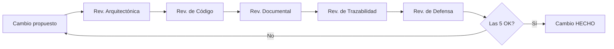

# 99 · Reglas de desarrollo del proyecto (CANÓNICO)

> **Fuente única y autoritativa** de la gobernanza de TesisAIOps. Estas reglas
> son **obligatorias** para cualquier cambio. Reemplazan y amplían el antiguo
> `07_reglas_desarrollo.md` (que ahora solo redirige aquí) para evitar
> divergencia documental (Regla 8).

Índice:
- [Parte A — Reglas base (R1–R12)](#parte-a--reglas-base-de-desarrollo-r1r12)
- [Parte B — Roles/Agentes de revisión (R13)](#parte-b--rolesagentes-de-revisión-r13)
- [Parte C — Definición de "Hecho" (R14)](#parte-c--definición-de-hecho-definition-of-done-r14)
- [Parte D — Reglas ampliadas (R15–R18)](#parte-d--reglas-ampliadas-r15r18)
- [Parte E — Formato de entrega al cerrar una tarea](#parte-e--formato-de-entrega-al-cerrar-una-tarea-r18)
- [Checklist operativo por cambio](#checklist-operativo-por-cambio)

---

## Parte A — Reglas base de desarrollo (R1–R12)

| # | Regla | Resumen |
|---|-------|---------|
| R1 | Documentación antes que código | Actualizar `02_arquitectura.md`, `03_flujos.md`, `01_trazabilidad.md` **antes** de implementar. |
| R2 | Trazabilidad obligatoria | Cada componente declara: qué hace, cuándo se invoca, **quién lo invoca**, qué recibe, qué devuelve, qué errores genera. |
| R3 | Comentarios obligatorios | Encabezado Python con: propósito, entradas, salidas, dependencias, riesgos, impacto de cambios. |
| R4 | Parámetros documentados | Todo parámetro en `04_parametros_configuracion.md`. Cero parámetros ocultos. |
| R5 | Diagramas obligatorios | Todo flujo importante en Mermaid (`docs/diagrams/` + `03_flujos.md`). |
| R6 | ADR obligatorios | Toda decisión arquitectónica en `05_bitacora_decisiones.md`. |
| R7 | Tests obligatorios | Todo módulo nuevo con pruebas básicas. |
| R8 | Actualización documental | Si cambia arquitectura/flujo/parámetro/comportamiento, se actualiza la doc. **Código y documentación no divergen.** |
| R9 | Explicación pedagógica | El código incluye explicación orientada al aprendizaje del autor. |
| R10 | Priorizar simplicidad | Elegir la solución más simple que cumpla los objetivos. |
| R11 | Cierre tipo tutor | Terminar cada tarea con el formato de entrega (ver Parte E, ahora ampliado por R18). |
| R12 | Banco de Preguntas de Defensa | Todo cambio técnico relevante actualiza `98_PREGUNTAS_DEFENSA.md`. |

> El detalle íntegro de R1–R12 se mantiene en esta tabla; eran las reglas
> originales del proyecto (antes en `07`).

---

## Parte B — Roles/Agentes de revisión (R13)

**R13.** El proyecto trabaja con **cinco roles de revisión**. Son *personas de
revisión* (perspectivas + checklists) que se aplican a cada cambio, **no**
agentes de software autónomos. Esta distinción es deliberada:

> ⚠️ **Aclaración para el tribunal (y coherencia con ADR-005):** estos "agentes"
> son un **mecanismo metodológico de revisión humana/asistida**. No son procesos
> autónomos, no se conectan a infraestructura y no ejecutan acciones. La regla
> "no crear agentes complejos todavía" sigue vigente para el *producto*; aquí
> hablamos del *proceso de desarrollo*. Ver ADR-009.

| Rol (Agente) | Qué revisa | Pregunta guía | Criterio de aprobación |
|--------------|-----------|---------------|------------------------|
| **Arquitecto** | Coherencia del diseño, encaje en la arquitectura, separación de responsabilidades | ¿Esto respeta la arquitectura y los principios (RAG, pipelines, solo-lectura)? | El cambio encaja en `02_arquitectura.md` sin romper invariantes. |
| **Desarrollador Python** | Calidad del código, comentarios (R3), simplicidad (R10), tests (R7) | ¿El código es claro, simple, comentado y probado? | Encabezados completos + pruebas en verde. |
| **Documentador** | Sincronía doc↔código (R8), parámetros (R4), diagramas (R5) | ¿La documentación refleja exactamente el comportamiento actual? | Sin divergencias; parámetros y flujos actualizados. |
| **Revisor de Trazabilidad** | Vínculos OE↔RF↔componente↔ADR↔pregunta de defensa (R17) | ¿Se puede rastrear el porqué de este cambio de punta a punta? | Matriz de `01_trazabilidad.md` actualizada y consistente. |
| **Tutor de Defensa** | Defendibilidad ante el jurado, banco de preguntas (R12/R16) | ¿Sabría defender esta decisión y sus alternativas? | `98_PREGUNTAS_DEFENSA.md` actualizado con la(s) pregunta(s) del cambio. |

---

## Parte C — Definición de "Hecho" (Definition of Done) (R14)

**R14.** Ningún cambio se considera **completo** hasta pasar las **cinco
revisiones** (una por rol de R13):

1. ✅ **Revisión arquitectónica** (Agente Arquitecto)
2. ✅ **Revisión de código** (Agente Desarrollador Python)
3. ✅ **Revisión documental** (Agente Documentador)
4. ✅ **Revisión de trazabilidad** (Agente Revisor de Trazabilidad)
5. ✅ **Revisión de defensa** (Agente Tutor de Defensa)

> En la práctica del MVP, el asistente desempeña estos cinco roles de forma
> secuencial y deja constancia en el formato de entrega (Parte E) de cuáles se
> aplicaron.



---

## Parte D — Reglas ampliadas (R15–R18)

**R15. Banco de defensa siempre vivo.** Todo cambio técnico relevante **debe**
actualizar `98_PREGUNTAS_DEFENSA.md` (refuerza R12). Si un cambio no genera
ninguna pregunta nueva, se justifica por qué en el cierre.

**R16. Preguntas tipo tribunal.** Cada entrada de `98_PREGUNTAS_DEFENSA.md` debe
poder responder las preguntas que haría un tribunal:
1. ¿Por qué se eligió esta tecnología?
2. ¿Qué problema resuelve?
3. ¿Qué alternativas existían?
4. ¿Por qué no se eligieron?
5. ¿Qué pasa si se cambia este parámetro?
6. ¿Cómo se evalúa / verifica?
7. ¿Qué limitaciones tiene?

**R17. Vínculo de toda decisión.** Toda decisión técnica debe enlazarse con sus
cinco anclas de trazabilidad:
- **Objetivo específico** (OE, ver `00_vision_general.md`)
- **Requisito** (RF/RNF, ver `01_trazabilidad.md`)
- **Componente** (ver `02_arquitectura.md`)
- **ADR** (ver `05_bitacora_decisiones.md`)
- **Pregunta de defensa** (ver `98_PREGUNTAS_DEFENSA.md`)

**R18. Formato de entrega ampliado** (sustituye al cierre de 6 puntos de R11).
Ver Parte E.

---

## Parte E — Formato de entrega al cerrar una tarea (R18)

Al finalizar **cualquier** tarea, el asistente entrega exactamente estos ocho
apartados:

```
Archivos creados:
Archivos modificados:
Reglas aplicadas:
Documentos actualizados:
Trazabilidad afectada:
Preguntas de defensa agregadas:
Riesgos o pendientes:
Siguiente paso recomendado:
```

---

## Checklist operativo por cambio

Antes de declarar un cambio "HECHO" (R14):

- [ ] (R1) Doc de arquitectura/flujos/trazabilidad actualizada **antes** de codificar.
- [ ] (R2) Componente con qué/cuándo/quién/entradas/salidas/errores.
- [ ] (R3) Encabezado Python con propósito/entradas/salidas/deps/riesgos/impacto.
- [ ] (R4) Parámetros nuevos en `04_parametros_configuracion.md`.
- [ ] (R5) Flujo nuevo/modificado con su diagrama Mermaid.
- [ ] (R6) Decisión relevante registrada como ADR.
- [ ] (R7) Pruebas básicas en verde.
- [ ] (R8) Sin divergencia código↔documentación.
- [ ] (R9) Explicación pedagógica incluida.
- [ ] (R10) Se eligió la opción más simple viable.
- [ ] (R13/R14) Pasadas las **5 revisiones** (arquitectura, código, doc, trazabilidad, defensa).
- [ ] (R15/R16) `98_PREGUNTAS_DEFENSA.md` actualizado con formato tribunal.
- [ ] (R17) Decisión vinculada a OE + RF + componente + ADR + pregunta de defensa.
- [ ] (R18) Cierre con el formato de entrega de 8 apartados.

---

> **Historia:** R1–R12 provienen del set original (antes en `07`). R13–R18 se
> añaden en esta revisión (ver ADR-009). Cualquier conflicto se resuelve a favor
> de este documento por ser el canónico.
